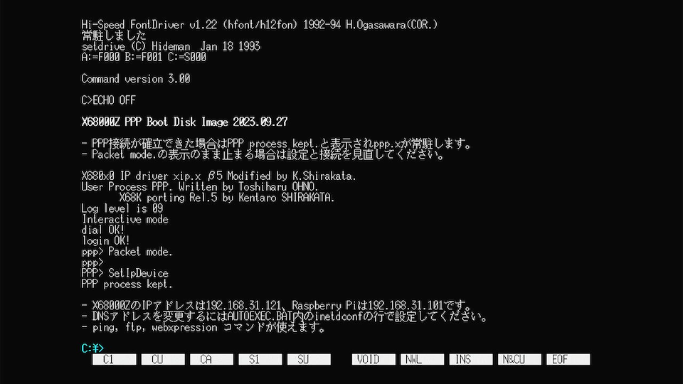
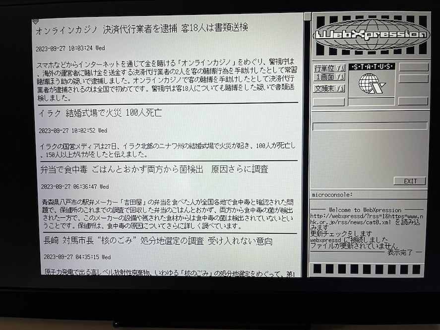
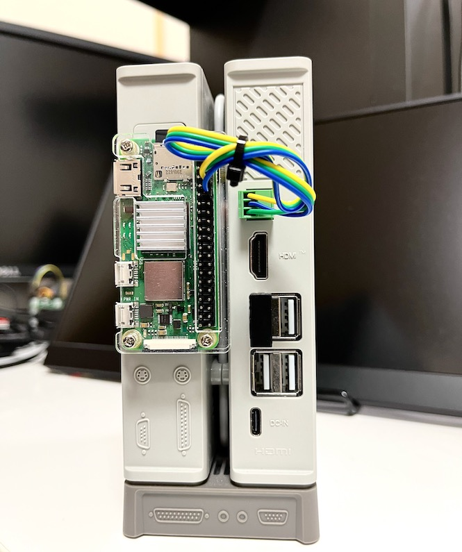
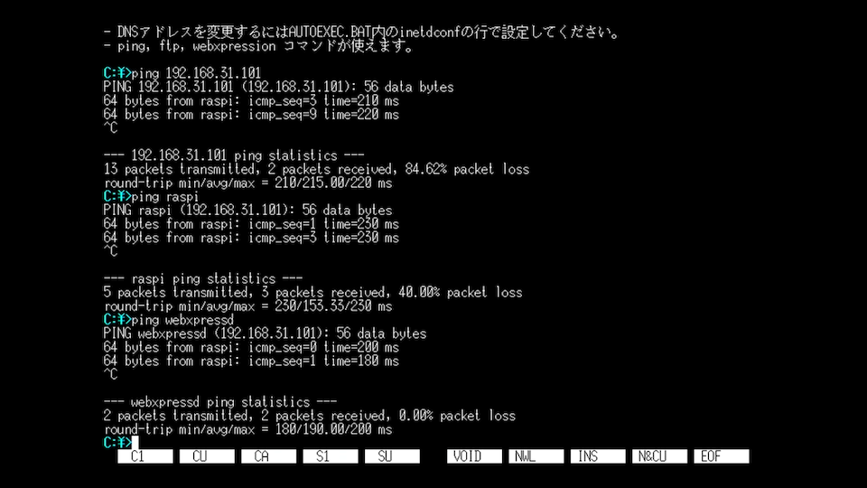
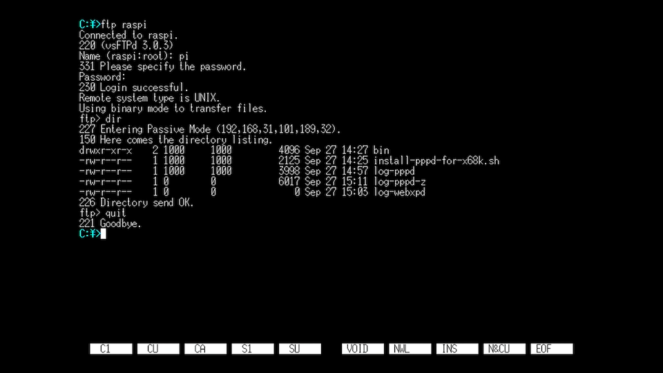
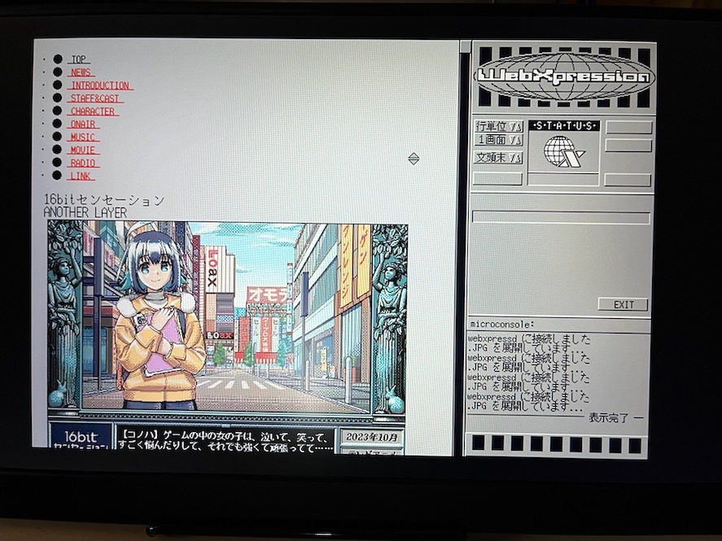

# PPP for X68000Z and Raspberry Pi

X68000ZをUARTクロスでRaspbery Piと接続し、PPPを利用してTCP/IPネットワークを使えるようにするためのメモです。

- X68000ZがPPPクライアント、Raspberry PiがPPPサーバとなります。
- X68000Zは接続先のRaspberry Piだけでなく、LAN上の他の機器やインターネットにもアクセスすることが可能です。

物理的なUART結線作業は必要ですが、設定の手間を減らす工夫をしてあります。

- Raspberry Pi側は自動で必要なソフトウェアの導入と設定を行うインストールスクリプトを用意しました。
- X68000Z側は、公式配布されている81MB HDDイメージをカスタマイズして、PPP構成済み起動HDDイメージを用意しました。

 

 

この覚書を書くにあたり、以下のサイトを参考にさせて頂きました。この場を借りてお礼申し上げます。

* [X680x0のインターネット関係ツールのページ](https://argrath.ub32.org/x680x0/internet.html) Human68k版のPPP移植開発者の白倉さん

* [X68000とRaspberry Piをシリアル接続してX68000にネット環境を構築する](http://retropc.net/mm/x68k/rasp-x/) パピコニアンさん

---

## そもそもPPPとは

イーサネット(Ethernet)通信などに変えてRS232Cシリアル通信をTCP/IPの物理層として使えるようにするための仕組みです。

通信速度は遅いかもしれませんが、繋がることがロマンであり、重要なのですw

詳しくは [Wikipedia](https://ja.wikipedia.org/wiki/Point-to-Point_Protocol) をどうぞ。

---

## 必要なもの

* X68000Z (ファームウェア1.3.1以降)
* X68000Z用UARTケーブル
* X68000Z用USBメモリ
* Raspberry Pi (Wi-Fiに繋がっていること)
* Raspberry Pi用新規microSDカード

X68000Z PRODUCT EDITIONはコンプリートパック以外UARTケーブルが付属していません。別途オプションとして購入するか自作してください。

秋月の2.54 3pターミナルブロックが使用できます。

* [秋月電子 ターミナルブロック　２．５４ｍｍ　３Ｐ](https://akizukidenshi.com/catalog/g/gP-17006/)

---

## 物理的な接続

X68000ZのUART端子とRaspberry PiのGPIO端子を双方電源を切った上で接続します。

- X68000Z UART GND(緑) - Raspberry Pi 6番ピン(GND)
- X68000Z UART RX(赤) - Raspberry Pi 8番ピン(GPIO14, UART_TXD0)
- X68000Z UART TX(青) - Raspberry Pi 10番ピン(GPIO15, UART_RXD0)

X68000Z の UART 配線色はロットによって違っている可能性もあるため、必ず付属の説明書にて確認してください。

 

---

## Raspberry Pi のセットアップ

### OSのクリーンインストール

Raspberry Pi Imager を使って、最新の Raspberry Pi OS Lite (32-bit) を新しいmicroSDカードに書き込みます。
歯車マークを押して、SSHを有効にし、Wi-Fiの設定もここで行ってしまいましょう。

なお、この覚書を書くに当たり確認を行なったのは Raspberry Pi OS Lite (32-bit) 2023.05.03 のみです。
本体は 3A+/3B+/4B/Zero2W であれば問題なく利用可能です。それ以前のモデルは使ったことが無いので分かりません。

### インストーラのダウンロードと実行

Raspberry Pi起動後、`pi`ユーザでログインし、インストール用スクリプトをダウンロードする。

        wget https://github.com/tantanGH/x68z-ppp/raw/main/script/install-pppd-for-x68k.sh

sudoで実行する。root権限でシステムファイルのいくつかを書き換えるので気になる場合は実行前に中身をよく確認すること。

        sudo sh install-pppd-for-x68k.sh

終わったら再起動する。

        sudo reboot

---

## X68000Z のセットアップ

### HDSイメージファイルのダウンロード

以下のリンクより、HDSファイルをダウンロードする。(81MB)

* [SCSIHDD81M_PPP_20230927.HDS](https://github.com/tantanGH/x68z-ppp/raw/main/hds/SCSIHDD81M_PPP_20230927.HDS)

USBメモリに書き込み、`pscsi.ini` を以下のように編集して直接起動する。

        [pscsi]
        ID0=SCSIHDD81M_PPP_20230927.HDS

### HDSイメージに含まれるソフトウェア

このイメージはZUIKI公式81MB HDDイメージにPPP接続なソフトウェアを追加で導入して構成したものです。すべて再配布可能であることを確認した上で、以下のソフトウェアを利用させていただいています。この場を借りてお礼申し上げます。

* [Human68k 3.02 システムディスク](http://retropc.net/x68000/software/sharp/human302/) SHARP(株)

* [TCP/IPドライバ・アプリケーション TCPPACKA](http://retropc.net/x68000/software/internet/kg/tcppacka/) 計測技研(株)

* [高速TCP/IPドライバ xip.x](http://retropc.net/x68000/software/internet/tcpip/xip/) K.Shirakataさん

* [IIJ-PPP on Human68k Rel.5](https://argrath.ub32.org/x680x0/internet.html#ppp) K.Shirakataさん

* [NetBSD移植版 FTPクライアント ftp.x](http://retropc.net/x68000/software/internet/ftp/ftp/) しゃあるさん

* [Webブラウザ WebXpression.X](http://retropc.net/x68000/software/internet/wwwbrowser/webxpression/) Mitsukyさん

* [JPEGローダ JPEGED+m01](http://retropc.net/x68000/software/graphics/jpeg/jpegedm01/) 砺波盛里さん、藤原尚伸さん、Mitsuky さん

* [高速IOCSドライバ HIOCS.X](http://retropc.net/x68000/software/system/iocs/hiocs/) Y.Nakamuraさん

* [ITA TOOLBOX](http://retropc.net/x68000/software/tools/itatoolbox/) 板垣史彦さん

* [TwentyOne.X](http://retropc.net/x68000/software/disk/filename/twentyone/) Extさん、GORRYさん

* [Hi-Speed Font Driver hfont.r](https://www.vector.co.jp/soft/x68/writing/se027934.html) 小笠原博之さん

* SETDRIVE.X (電脳倶楽部 Vol.58) Hidemanさん (\USR\SYS\ に添付文書あり)

* 要町フォント (電脳倶楽部 Vol.43) 海老原勇士さん (\USR\SYS\ に添付文書あり)

### X68000Z固有の問題への対処

以下の2つのソフトウェアについては、残念ながら現在の X68000Z 用エミュレータ (1.3.1) では一部期待通りの動作をしません。

* PPP.X
* WebXpression.X

この文書の筆者である tantan が独自に対処療法的なパッチを行ったものを組み込んであります。
よって、HDSイメージ内のファイルを再配布しないようにくれぐれもご注意ください。

---

## 動作確認

Raspberry Pi の電源を入れてから Human68k を起動する。

SetIpDevice と PPP process kept. のメッセージが確認できればPPP接続が確立しています。
もし途中で止まる場合は接続と設定を見直してください。

### DNSアドレスの変更

AUTOEXEC.BAT の中の inetdconf.x の行を修正して、DNSサーバのIPアドレスをご自身の環境に合わせて変更してください。

### 動作確認 (ping)

PPPのIPアドレスは以下のように構成されています。

- Raspberry PiのIP ... 192.168.31.101
- X68000ZのIP ... 192.168.31.121

双方からpingして相手の応答があることを確認してください。

また、X68000Z側からはホスト名でもpingできることを確認してください。

        ping raspi
        ping webxpressd

### 動作確認 (FTP)

X68000Z側からRaspberry Piに対してFTP接続ができるか確認してください。

        ftp raspi

### 動作確認 (Web - RSS)

以下のコマンドでNHKのRSSニュースを読んでみる。

        webxpression http://webxpressd/?rss=1&https=www.nhk.or.jp/rss/news/cat0.xml

中間サーバ webxpressd はRSS ニュースフィードをHTMLに整形して返す機能を内蔵しています。
RSSは通常のHTMLサイトに比べて非常に軽量ですので、PPP環境でも比較的ストレスなく閲覧できます。

 

### 動作確認 (Web - https)

以下のコマンドでhttpsサイトを読んでみる。画像の展開にやや時間がかかります。

        webxpression http://webxpressd/?https=16bitsensation-al.com/90s/

WebXpression は http かつ SJIS のサイトにしか対応していません。プリプロセッシングを行う中間サーバのwebxpressdを経由することで https や UTF-8 のサイトにもアクセスできるようになります。

 

---

## 制限事項

* 速度が遅い

実機+Nereid(Neptune)と比べるとただでさえ遅いPPPを、さらに安定性重視で19200bpsとしているため速度は期待できません。
逆にこちらを先に試してからNereid(Neptune)を実機で使うとその速さに驚くかもしれません。

* telnetがいまいち

動かないことはないのですが、かなりつっかかり固まってしまうこともあります。非推奨です。FTPもTCPPACKAのものだと正常に動作しない場合があるため、NetBSD移植版(本HDSに入っているもの)をお勧めします。

---

## 変更履歴

* 2023.09.27 ... 初版
