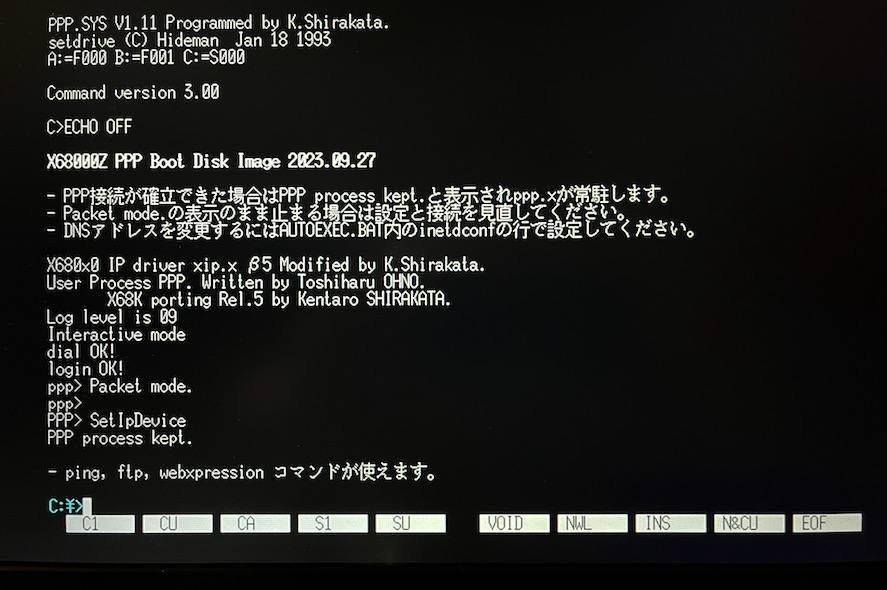
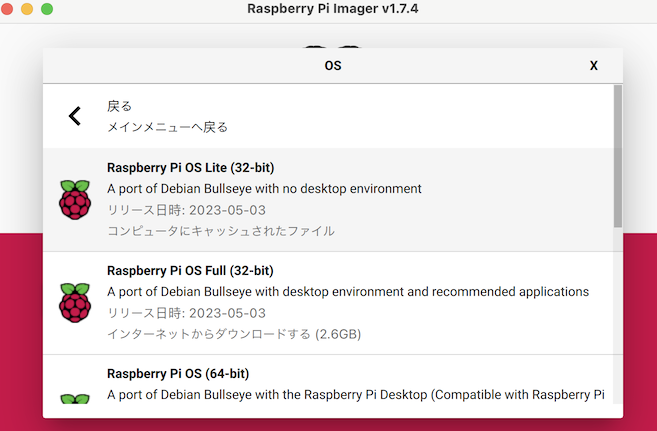

# PPP for X68000Z and Raspberry Pi

この覚書は、X68000ZをUARTクロスでRaspbery Piと接続し、PPPを利用してTCP/IPネットワークを使えるようにするためのメモです。

- Raspberry Pi側は自動設定のインストールスクリプトを用意しました。
- X68000Z側は、公式配布されている81MB HDDイメージをカスタマイズした構成済み起動HDDイメージを用意しました。

物理的なUART結線作業は必要ですが、比較的気軽に電源ONで楽々操作みあると思います。

---

## そもそもPPPとは

イーサネット(Ethernet)通信などに変えてRS232Cシリアル通信をTCP/IPの物理層として使えるようにするための仕組みです。

通信速度は遅いかもしれませんが、繋がることがロマンであり、重要なのですw

詳しくは [Wikipedia](https://ja.wikipedia.org/wiki/Point-to-Point_Protocol) をどうぞ。

---

## 必要なもの

* X68000Z (ファームウェア1.3.1以降)
* X68000Z用UARTケーブル
* X68000Z用USBメモリ
* Raspberry Pi (Wi-Fiに繋がっていること)
* Raspberry Pi用新規microSDカード

X68000Z PRODUCT EDITIONはコンプリートパック以外UARTケーブルが付属していません。別途オプションとして購入するか自作してください。

秋月の2.54 3pターミナルブロックが使用できます。

* [秋月電子 ターミナルブロック　２．５４ｍｍ　３Ｐ](https://akizukidenshi.com/catalog/g/gP-17006/)

---

## 物理的な接続

X68000ZのUART端子とRaspberry PiのGPIO端子を双方電源を切った上で接続します。

- X68000Z UART GND(緑) - Raspberry Pi 6番ピン(GND)
- X68000Z UART RX(赤) - Raspberry Pi 8番ピン(GPIO14, UART_TXD0)
- X68000Z UART TX(青) - Raspberry Pi 10番ピン(GPIO15, UART_RXD0)

X68000Z の UART 配線色はロットによって違っている可能性もあるため、必ず付属の説明書にて確認してください。

---

## Raspberry Pi のセットアップ

### OSのクリーンインストール

Raspberry Pi Imager を使って、最新の Raspberry Pi OS Lite (32-bit) を新しいmicroSDカードに書き込みます。
歯車マークを押して、SSHを有効にし、Wi-Fiの設定もここで行ってしまいましょう。

なお、この覚書を書くに当たり確認を行なったのは Raspberry Pi OS Lite (32-bit) 2023.05.03 のみです。
本体は 3A+/3B+/4B/Zero2W であれば問題なく利用可能です。それ以前のモデルは使ったことが無いので分かりません。

### インストーラのダウンロードと実行

Raspberry Pi起動後、`pi`ユーザでログインし、インストール用スクリプトをダウンロードする。

        wget https://github.com/tantanGH/x68z-ppp/raw/main/script/install-pppd-for-x68k.sh

sudoで実行する。root権限でシステムファイルのいくつかを書き換えるので気になる場合は実行前に中身をよく確認してください。

        sudo sh install-pppd-for-x68k.sh

終わったら再起動する。

        sudo reboot

---

## 動作確認 (FTP)

## 動作確認 (Web - https)

以下のコマンドでhttpsサイトを読んでみる。画像の展開にやや時間がかかります。

        webxpression http://webxpressd/?https=16bitsensation-al.com/90s/

WebXpression は http かつ SJIS のサイトにしか対応していません。プリプロセッシングを行う中間サーバのwebxpressdを経由することで https や UTF-8 のサイトにもアクセスできるようになります。

## 動作確認 (Web - RSS)

以下のコマンドでNHKのRSSニュースを読んでみる。

        webxpression http://webxpressd/?rss=1&https=www.nhk.or.jp/rss/news/cat0.xml

中間サーバ webxpressd はRSS ニュースフィードをHTMLに整形して返す機能を内蔵しています。
RSSは通常のHTMLサイトに比べて非常に軽量ですので、PPP環境でも比較的ストレスなく閲覧できます。
